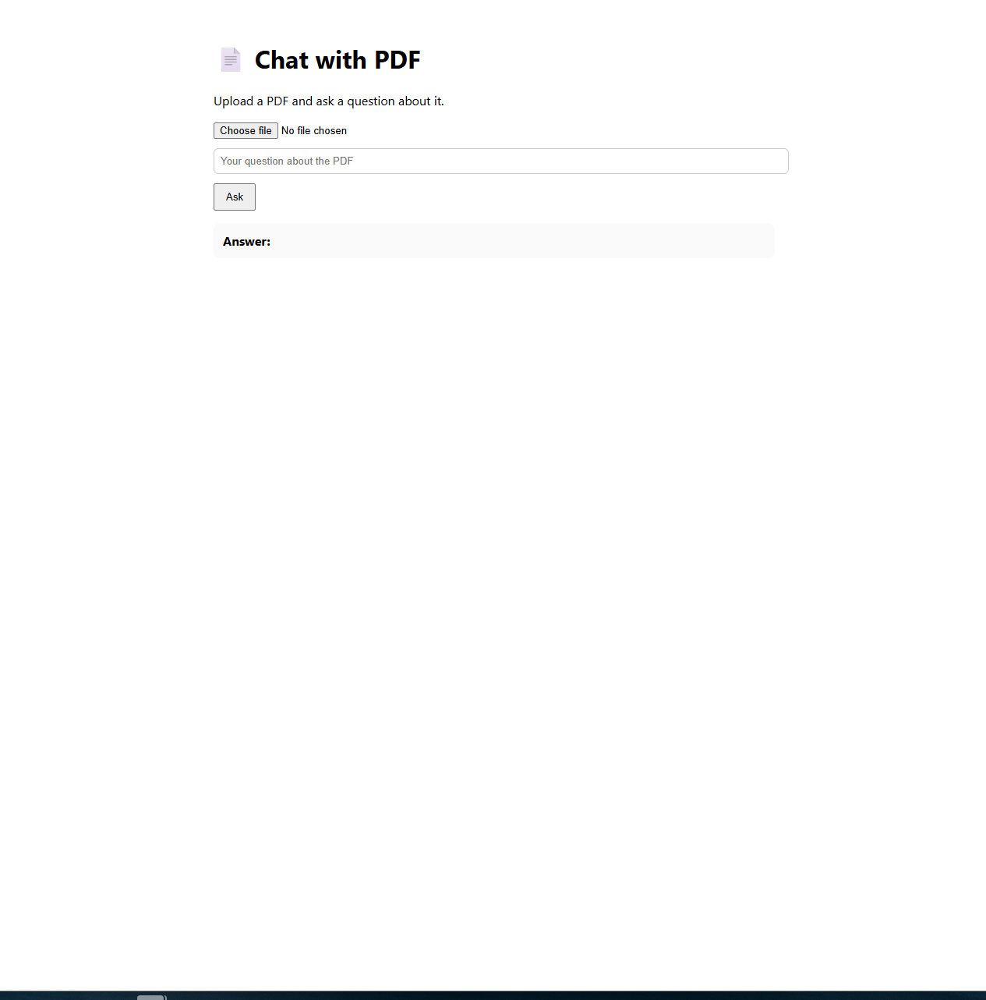

# 🚀 AI-Powered Full-stack Projects Portfolio

Hi, I’m Yaroslav — a **Full-stack Web Developer** building modern **AI-powered applications**.  
I combine **React / Next.js / Node.js** with **OpenAI, LangChain, and vector DBs** to deliver practical solutions.

---

## 📂 Featured Projects

### 1. [📄 Chat with PDF](./chat-with-pdf)
Upload a PDF and ask AI-powered questions about it.  
**Stack:** Next.js, Node.js, OpenAI API, pdf-parse, Chroma  

---

### 2. [📝 AI Blog Generator](./ai-blog-generator)
Generate complete blog posts (title, intro, body) from a single topic using GPT.  
**Stack:** Next.js, Node.js, OpenAI API  

---

### 3. [💬 AI FAQ Assistant](./ai-faq-assistant)
Website chatbot trained on FAQ data to support users in real time.  
**Stack:** Next.js, Express, OpenAI API, LangChain, Pinecone  

---

## 🛠 Tech Skills
- **Frontend:** React, Next.js, TypeScript, SCSS  
- **Backend:** Node.js, Express, REST, GraphQL  
- **AI Tools:** OpenAI API, LangChain, LlamaIndex, Pinecone, Chroma  
- **Other:** Git, Docker, CI/CD, Agile  

---

## 🌍 Live Demos (optional)
> You can deploy on **Vercel** in one click and paste links here. Recruiters LOVE live demos 😉

##  Contact
- LinkedIn: https://www.linkedin.com/in/yaroslav-hapotchenko-782b162a3/
- Email: gyarik80@gmail.com
